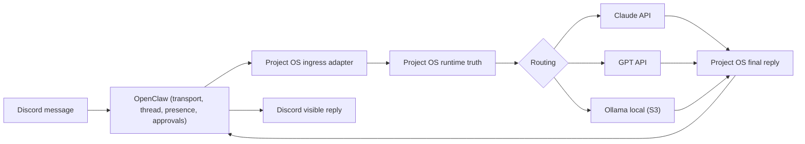

# Discord Operating Model

`Discord` est la surface conversationnelle distante de `Project OS`.

Ce document se lit en tandem avec:

- `docs/roadmap/DISCORD_FOUNDER_SURFACE_REPAIR_V2_PLAN.md`
- `docs/architecture/FOUNDER_SURFACE_MODEL.md`

Le futur point d'entree local pilotable principal est `Project OS.exe`.
`Discord` reste:

- la branche de discussion
- l'arbitrage
- le travail distant
- le pilotage leger
- la supervision resumee et actionnable

Le but n'est pas de faire un simple bot de chat.
Le but est de faire une interface operateur haut niveau.

Corollaire produit:

- si un humain doit lire un fichier JSON pour comprendre l'etat d'un run, le workflow est mauvais
- `Discord` doit porter la partie conversation, arbitrage et retour humain des gros runs
- l'app locale doit porter le control plane, la vue systeme et le terminal maitre
- `Discord` ne doit pas devenir un tableau de bord systeme par defaut

## Doctrine de surface

`Discord` doit montrer par defaut:

- reponse utile
- clarification utile
- relance utile
- decision courte
- etat operateur actionnable
- incident formule humainement

`Discord` ne doit pas montrer par defaut:

- `queue`
- `backlog`
- `pending missions`
- `gateway health`
- `internal routing`
- `provider details`
- `technical approvals`
- traces brutes

`Discord` peut montrer sur demande explicite ou sur alerte reellement actionnable:

- details d'execution
- sante gateway
- file d'attente
- backlog mission
- modele/provider reels
- details de cout et de lane

Regle dure:

- `control-plane data stays out of normal chat unless explicitly requested or truly actionnable`

## Roles de Discord

`Discord` sert a:

- discuter
- donner une direction
- demander un statut
- lancer ou reprendre une mission
- demander une preuve
- poser un doute
- arbitrer un risque
- envoyer des vocaux transcrits plus tard
- recevoir les points de passage d'un gros run API
- recevoir les clarifications bloquantes
- recevoir le verdict final sans ouvrir le runtime

## Workflow canonique

Le pipeline Discord retenu doit rester lisible:

- `OpenClaw` porte la surface Discord
- `Project OS` garde la verite runtime
- `Claude API`, `GPT API` et `Ollama` sont appeles par `Project OS`
- une seule voix publique doit sortir sur Discord: `Project OS`

Corollaires:

- `OpenClaw` n'est pas un second cerveau autonome
- `OpenClaw` ne doit pas improviser une personnalite ou une memoire paralleles
- `Claude API` peut etre le moteur principal de discussion Discord sans devenir la verite du systeme
- la voix publique reste celle d'un seul agent visible, jamais celle des sous-agents

Implementation actuelle:

- la voix publique Discord est rendue depuis `config/project_os_persona.yaml`
- le gateway reconstruit un prompt par tour via `src/project_os_core/gateway/context_builder.py`
- le contexte inclut la verite runtime, le contexte session recent, l'historique recent du thread et un `handoff contract` minimal

## Overrides operateur

Le fondateur peut forcer ponctuellement le provider de discussion au tout debut du message:

- `CLAUDE <message>`
- `SONNET <message>`
- `OPUS <message>`
- `GPT <message>`
- `LOCAL <message>`
- `OLLAMA <message>`

Variantes acceptees:

- `CLAUDE: <message>`
- `SONNET: <message>`
- `OPUS: <message>`
- `GPT: <message>`
- `LOCAL: <message>`
- `OLLAMA: <message>`

Regles canoniques:

- le prefixe est reconnu uniquement au debut du message
- le prefixe est retire avant classification, routage et memoire canonique
- `CLAUDE` et `SONNET` gardent la lane Anthropic discussion standard
- `OPUS` force la lane Anthropic haut de gamme pour les questions plus difficiles
- le texte brut d'origine reste trace dans les metadata runtime
- la voix publique reste `Project OS`, quel que soit le provider force

Regle supplementaire:

- l'override change le modele du tour, pas la personnalite ni la verite runtime
- le `handoff contract` garde le message brut d'origine et le message normalise pour eviter le telephone arabe

Priorite stricte:

- `S3`
- override operateur
- route automatique

Donc:

- `CLAUDE OPENCLAW_GATEWAY_TOKEN=...` ne part jamais au cloud
- un `S3` garde toujours la priorite locale ou le blocage ferme
- sans prefixe, la route par defaut reste active

Topologie cible:

- `#general` comme entree fondatrice par defaut
- `#pilotage`
- `#runs-live`
- `#approvals`
- `#incidents`
- threads par mission

Les deliberations multi-angles se branchent sur cette topologie existante:

- ouverture depuis `#general` en priorite
- `#pilotage` reste autorise pendant la transition
- thread dedie pour la reunion
- synthese finale dans le thread
- synthese humaine finale republiquee dans `#general`
- miroir dans `#approvals` si la decision est sensible
- lien vers `#runs-live` seulement si la reunion debouche sur un run

## Ce que Discord n'est pas

`Discord` n'est pas:

- la memoire canonique
- la verite machine
- l'unique coeur pilotable local du projet
- le control plane
- l'endroit ou les workers decident eux-memes
- un contournement du `Mission Router`

`Discord` n'est pas non plus:

- un endroit ou la persona est improvisee
- une couche qui cache le vrai provider du tour
- une surface qui perd l'intention brute du fondateur entre deux appels modele
- une surface qui expose naturellement les sous-agents

## Types de messages

Chaque message recu doit etre classe dans l'une de ces familles:

- `chat`
- `status_request`
- `tasking`
- `idea`
- `decision`
- `note`
- `approval`
- `artifact_ref`

## Policy selective sync

La memoire Discord suit une policy `selective_sync`.

Donc:

- tout passe dans le journal operateur
- tout ne passe pas dans la memoire durable

Promotions typiques:

- preference stable
- decision explicite
- mission importante
- incident reel
- retour utile du fondateur

## Routing modele recommande

Le meme agent doit rester coherent, mais le cout cognitif doit s'adapter.

Regle dure supplementaire:

- pas de double personnalite entre la surface Discord et la surface desktop

### Cas banal Discord

Exemples:

- salut
- check rapide
- petite question de statut
- accuse de reception
- mini reformulation

Route recommandee:

- classification locale ou deterministic first
- si LLM necessaire: `Claude API` pour discussion/traduction compacte
- si le message ouvre un vrai travail de fond: escalade vers `GPT API`

Contexte reconstruit pour chaque tour:

- persona canonique
- provider / modele reels du tour
- contexte session recent
- historique recent du thread
- hint de mood leger
- handoff contract minimal

### Cas operateur standard

Exemples:

- clarification utile
- mini plan
- decision simple
- retour de mission

Route recommandee:

- `gpt-5.4` avec `reasoning.effort=high`

### Cas complexe / critique

Exemples:

- arbitrage architecture
- incident ambigue
- reprise apres echec
- mission a fort cout d'erreur

Route recommandee:

- `gpt-5.4` avec `reasoning.effort=xhigh`

### Cas exceptionnel

Exemples:

- arbitrage majeur
- run d'urgence multi-systeme
- demande explicitement marquee exceptionnelle

Route:

- `gpt-5.4-pro`
- jamais par defaut
- approval fondateur obligatoire

## Pourquoi ce choix

Le but est:

- garder la meme identite agent
- economiser le budget
- ne pas surpayer les banalites
- reserver le raisonnement maximal aux moments qui le meritent

## Verrou de qualite

La voie Discord est maintenant protegee par des checks de non-regression.

Exemples de checks:

- `qui es-tu ?` ne doit jamais rebasculer vers "assistant numerique nomme Theo"
- `quelle api / quel modele ?` doit suivre le runtime du tour
- `OPUS <message>` doit forcer le modele sans changer la voix publique
- les sujets legers peuvent relacher un peu le ton, sans perdre le cadre de travail
- les sujets sensibles doivent redevenir tres nets

## Voix

Le mode voix est `future_ready`.

V1:

- on passe par transcription texte
- la transcription entre ensuite dans le meme pipeline que Discord texte

Regle:

- pas de deuxieme cerveau voix
- pas de memoire speciale voix
- la transcription est juste une autre entree operateur

## Politique de parole

Profils de sortie Discord:

- `notification_card` pour les signaux operateur courants et les cartes `#runs-live`
- `meeting_thread` pour les deliberations structurees visibles
- `founder_synthesis` pour la synthese humaine finale dans `#general`

Pendant un gros run de code:

- pas de conversation naturelle sur Discord
- le suivi se fait via `#runs-live`
- seules les cartes compactes, blocages reels et rapports finaux sont autorises

Evenements minimums attendus dans `Discord` pour un gros run API:

- `contract_proposed`
- `clarification_required`
- `run_completed`
- `run_failed`

Note:

- `run_started` n'est pas emis sur `Discord`
- il est filtre comme bruit pur (cf. ADR 0013 et `DAILY_OPERATOR_WORKFLOW`)
- les `notification_card` restent bornees a 3 lignes max
- les `meeting_thread` et `founder_synthesis` ne suivent pas cette limite, mais restent concis et lisibles

Chaque carte doit rester courte et comprehensible par un humain non developpeur.
Les artefacts runtime peuvent etre lies comme preuves, mais ne doivent pas etre la seule explication.

Dans `#general`:

- l'agent reste souple
- mais toujours en francais clair et non technique si ce n'est pas necessaire

Dans `#pilotage`:

- le comportement doit rester aligne sur `#general`
- ce salon est traite comme une surface de compatibilite/transitoire

## Reunions multi-angles structurees

Quand une simple reponse ne suffit plus, `Discord` peut porter une deliberation structuree.

But:

- confronter plusieurs prismes sans theatre
- produire une synthese arbitrable
- garder la discussion lisible pour le fondateur

Regles:

- un seul bot
- identites logiques `[Vision]`, `[Tech]`, `[RedTeam]`, etc.
- `Moderator` procedurale
- threads first
- thread visible toujours
- format strict
- synthese finale obligatoire
- `Discord` ne devient jamais la memoire canonique

## OpenClaw Discord UX retenue

Le socle `OpenClaw` retenu pour `Discord` est volontairement minimal et robuste:

- `threadBindings` pour garder un fil durable entre thread et runtime
- `execApprovals` pour les approvals Discord natives a faible ambiguite
- `autoPresence` pour refleter la sante runtime

Regles:

- `threadBindings` oui
- approvals upstream en `dm`
- cards compactes dans les salons
- pas de components metier riches tant qu'ils ne sont pas prouves sans ambiguite

Le mapping canonique reste:

- `Discord` = remote conversation plane
- `Project OS.exe` = operational control plane
- `Project OS runtime` = verite runtime

References:

- `docs/analysis-angles/README.md`
- `docs/analysis-angles/07-meeting-types.md`
- `docs/integrations/DISCORD_MEETING_SYSTEM_V1.md`
