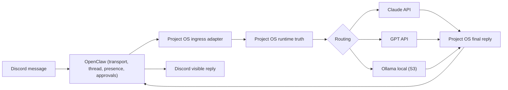

# OpenClaw Gateway Adapter

Ce document fige le lot `OpenClaw live bootstrap + replay + doctor` entre `OpenClaw` et `Project OS`.

## Principe

`OpenClaw` reste la facade operateur:

- Discord
- WebChat
- Control UI
- inbox
- pairing

`Project OS` reste le coeur:

- runtime truth
- memory
- mission router
- workers
- evidence

## Point d'integration retenu

On n'a pas modifie le channel Discord d'`OpenClaw`.
On branche un plugin local qui ecoute le hook:

- `message_received`

Puis le plugin:

1. transforme l'evenement `OpenClaw`
2. construit une charge utile canonique
3. appelle `Project OS` via CLI
4. laisse `Project OS` prendre toutes les decisions

Point important:

- sur `OpenClaw 2026.3.12`, `message_received` est fire-and-forget et ne bloque pas la reponse native
- la neutralisation de la voix native Discord doit donc passer par `session.sendPolicy`
- `message_sending` reste seulement un garde-fou secondaire
- la reponse publique visible doit sortir par l'envoi direct Discord du plugin Project OS

Diagramme canonique:



Lecture imposee:

- `OpenClaw` porte la surface et le transport
- `Project OS` garde la verite, la memoire et le routage
- `Claude API` peut etre le moteur de discussion principal, sans devenir une seconde identite publique
- la voix visible sur Discord doit rester `Project OS`

## Overrides de provider

L'adapter d'entree accepte maintenant des prefixes operateur simples au debut du message:

- `CLAUDE`
- `SONNET`
- `OPUS`
- `GPT`
- `LOCAL`
- `OLLAMA`

Effet canonique:

1. le prefixe est detecte au niveau ingress
2. le texte est nettoye avant d'entrer dans le routeur
3. les metadata runtime gardent:
   - `requested_provider`
   - `requested_model_family`
   - `requested_route_mode`
   - `message_prefix_consumed`
   - `raw_operator_text`
   - `normalized_operator_text`
4. `Project OS` decide ensuite avec la regle dure `S3 > override > auto`

Cette grammaire ne cree pas une seconde personnalite:

- `OpenClaw` ne pense toujours pas a cote
- `Project OS` reste la seule voix publique
- le prefixe ne fait que choisir la lane de modele pour ce tour
- `OPUS` force explicitement la voie Anthropic premium pour ce tour

## Fichiers du lot

- `src/project_os_core/gateway/openclaw_adapter.py`
- `src/project_os_core/gateway/openclaw_live.py`
- `src/project_os_core/cli.py`
- `integrations/openclaw/project-os-gateway-adapter/package.json`
- `integrations/openclaw/project-os-gateway-adapter/index.js`
- `integrations/openclaw/project-os-gateway-adapter/openclaw.plugin.json`
- `integrations/openclaw/project-os-gateway-adapter/replay_harness.mjs`
- `integrations/openclaw/project-os-gateway-adapter/README.md`
- `fixtures/openclaw/*.json`
- `tests/unit/test_openclaw_live.py`

## Commande canonique du plugin

Le plugin appelle:

```bash
py D:/ProjectOS/project-os-core/scripts/project_os_entry.py --config-path D:/ProjectOS/project-os-core/config/storage_roots.local.json --policy-path D:/ProjectOS/project-os-core/config/runtime_policy.local.json gateway ingest-openclaw-event --stdin
```

## Politique

- `OpenClaw` ne stocke pas la memoire canonique
- `OpenClaw` ne route pas lui-meme les missions
- `OpenClaw` ne contourne pas le `Mission Router`
- les acks de canal restent optionnels et desactives par defaut
- aucune preuve operateur humaine n'est consideree acquise sans un vrai message Discord/WebChat
- tant que le replay ou le doctor sont rouges, le mode live doit echouer ferme

## Runtime reel retenu

- runtime OpenClaw: `D:\ProjectOS\openclaw-runtime`
- state OpenClaw: `D:\ProjectOS\runtime\openclaw`

Le code source `OpenClaw` reste une dependance dans `third_party`.
Le runtime actif ne tourne pas dans le checkout source.

## Bootstrap retenu

La voie retenue est la voie native `OpenClaw`:

```bash
openclaw plugins install --link D:/ProjectOS/project-os-core/integrations/openclaw/project-os-gateway-adapter
```

Le bootstrap `Project OS` doit:

1. verifier le binaire `openclaw`
2. preparer les racines runtime et state
3. lier le plugin local
4. verifier le manifest plugin
5. verifier l'entree Python `Project OS`

## Doctor retenu

La commande canonique est:

```bash
py D:/ProjectOS/project-os-core/scripts/project_os_entry.py openclaw doctor
```

Le doctor verifie:

- binaire `OpenClaw`
- racines runtime/state
- manifest plugin
- entree Python callable
- channels actifs
- policy `silence + fin`
- socle Discord Pack 2:
  - `threadBindings`
  - `autoPresence`
  - `execApprovals`
- contrat `single voice` Discord:
  - `session.sendPolicy` deny pour `discord/group` et `discord/channel`
  - `default = allow`
  - `suppressNativeDiscordReplies = true`
  - `DISCORD_BOT_TOKEN` disponible pour le direct-send REST
- voie locale Windows-first:
  - `local_model_route`
- plugin visible dans `OpenClaw`
- config `OpenClaw` valide
- statut gateway lisible

## Trust plugin pairing

Le durcissement `plugin + pairing` est maintenant audite par une commande dediee:

```bash
py D:/ProjectOS/project-os-core/scripts/project_os_entry.py --config-path D:/ProjectOS/project-os-core/config/storage_roots.local.json --policy-path D:/ProjectOS/project-os-core/config/runtime_policy.local.json openclaw trust-audit
```

Cette commande prouve localement:

- l'allowlist plugin active
- la provenance d'installation du plugin Project OS
- la coherence du store de pairing local
- la rotation des tokens device
- l'absence de fuite de secrets plugin/pairing dans les surfaces visibles scannees

Runbook detaille:

- [OPENCLAW_PLUGIN_PAIRING_HARDENING.md](OPENCLAW_PLUGIN_PAIRING_HARDENING.md)
- [OPENCLAW_DISCORD_OPERATIONS_UX.md](OPENCLAW_DISCORD_OPERATIONS_UX.md)

Le verdict doit rester comprehensible pour un non-developpeur:

- `OK`
- `bloque`
- `a corriger`

## Workflow de tests retenu

Le workflow canonique de verification locale passe par:

```powershell
py scripts/project_os_tests.py --suite smoke
py scripts/project_os_tests.py --suite gateway
py scripts/project_os_tests.py --suite full --with-strict-doctor --with-openclaw-doctor
```

Regles:

- `smoke` = boucle rapide developpeur, fail fast sur les surfaces coeur (`router`, `mission chain`, `api runs`, `dashboard`)
- `gateway` = verifie la boucle OpenClaw/Discord/doctor sans attendre toute l'integration
- `full` = validation avant merge, avec doctors inclus
- `pytest -q` a la racine du repo doit rester borne a `tests/unit` + `tests/integration` via `pytest.ini`
- `third_party` ne doit jamais rendre un faux rouge sur le coeur du projet

## Installation Windows retenue

Le mode cible reste une installation gateway geree par `OpenClaw`.

Commande canonique en session PowerShell admin:

```powershell
powershell -File scripts/project_os_install_openclaw_gateway_admin.ps1
```

Ce script:

1. exige une session admin
2. verifie que `openclaw.json` utilise deja des SecretRefs `env`
3. force la presence de `session.sendPolicy` pour couper la voix native Discord sur `group/channel`
4. verifie la presence de `DISCORD_BOT_TOKEN` et `OPENCLAW_GATEWAY_TOKEN` au niveau utilisateur Windows
5. installe le gateway gere via `openclaw gateway install --force`
6. relance le service
7. supprime le fallback `Startup` si le service gere est sain

Tant que ce script n'a pas tourne en admin avec succes, le fallback `Startup` peut rester en place pour maintenir un runtime vivant, mais ce n'est pas l'etat final cible.

Verification canonique post-install:

```powershell
py D:/ProjectOS/project-os-core/scripts/project_os_entry.py --config-path D:/ProjectOS/project-os-core/config/storage_roots.local.json --policy-path D:/ProjectOS/project-os-core/config/runtime_policy.local.json openclaw truth-health --channel discord
```

Lecture attendue:

- `OK` si la sante machine est bonne et qu'une preuve live recente existe deja
- `a_corriger` si la machine est saine mais qu'aucune preuve canonique recente n'a encore ete prouvee jusqu'au `Mission Router`
- `bloque` si le gateway ou la config restent bancals

Attention:

- la preuve runtime retenue par `truth-health` et `validate-live` est aujourd'hui une `preuve canonique enregistree`
- elle exige un event `source=openclaw` qui atteint `Gateway -> Mission Router`
- cette preuve peut venir soit d'un vrai event amont `OpenClaw`, soit d'un payload canonique injecte via `gateway ingest-openclaw-event`
- une preuve operateur Discord reelle reste un cran plus strict, utile pour une cloture humaine finale

Le champ `service.runtime.status` peut rester `unknown` sur Windows meme quand la tache planifiee et le listener sont sains. Ne pas utiliser ce champ seul comme critere de succes.

La verite live Windows retenue est:

- `service.loaded = true`
- `port.status = busy`
- `rpc.ok = true` si disponible
- absence de fallback `Startup`
- projection `discord_thread_bindings` visible dans le runtime des qu'un event Discord recent existe

## Self-heal et watchdog

Un message Discord ne peut pas reveiller un gateway mort: si le listener local est casse, le message n'atteint deja plus la machine.
La reparation doit donc partir du poste lui-meme.

Commande canonique manuelle:

```powershell
py D:/ProjectOS/project-os-core/scripts/project_os_entry.py --config-path D:/ProjectOS/project-os-core/config/storage_roots.local.json --policy-path D:/ProjectOS/project-os-core/config/runtime_policy.local.json openclaw self-heal
```

Cette commande:

1. lit la verite utile (`service.loaded`, `port.status`, `rpc.ok`)
2. ne fait rien si le gateway est deja sain
3. tente `gateway restart`
4. tente `gateway start` si le restart n'a pas suffi
5. ecrit un rapport runtime dans `runtime/openclaw/live/latest_self_heal.json`

Installation canonique du watchdog Windows utilisateur:

```powershell
powershell -ExecutionPolicy Bypass -File D:/ProjectOS/project-os-core/scripts/project_os_install_openclaw_watchdog.ps1 -RunNow
```

Mode retenu sur le poste Windows:

- supervision periodique toutes les `2 minutes` via `schtasks`
- relance au logon via le dossier `Startup` si Windows refuse un vrai trigger `AtLogOn`
- cooldown de reparation pour eviter les boucles de restart

## Replay retenu

Le replay est obligatoire avant tout live:

```bash
py D:/ProjectOS/project-os-core/scripts/project_os_entry.py openclaw replay --all
```

Les fixtures couvrent:

- message texte simple
- message avec piece jointe
- message de type `tasking`
- message qui doit rester hors memoire durable

Le replay doit prouver:

- `OpenClaw -> plugin -> CLI Project OS -> Gateway -> Mission Router`
- aucun bypass memoire canonique
- aucun bypass `Mission Router`

## Pack 2 Discord UX

Le socle UX Discord retenu repose d'abord sur les primitives upstream `OpenClaw`, pas sur des handlers custom fragiles:

- `session.threadBindings`
- `channels.discord.threadBindings`
- `channels.discord.autoPresence`
- `channels.discord.execApprovals`

Project OS ajoute seulement ce qui manque pour garder la verite canonique:

- projection `discord_thread_bindings` dans SQLite
- checks doctor/truth-health
- payloads sortants Discord plus precis quand un target/reply/components explicite existe

La policy retenue reste sobre:

- `execApprovals` en `dm`
- `threadBindings` actifs
- `autoPresence` actif
- `session.sendPolicy` deny pour `discord/group` et `discord/channel`
- pas de components metier riches tant qu'ils ne sont pas prouvables sans ambiguite

## Validation live

La commande:

```bash
py D:/ProjectOS/project-os-core/scripts/project_os_entry.py openclaw validate-live --channel discord
```

reste bloquee tant qu'aucune preuve canonique recente `OpenClaw -> Mission Router` n'a ete enregistree.

Elle reussit des qu'une preuve canonique recente laisse une trace:

- `channel_event`
- `gateway_dispatch_result`
- `decision_id` ou `mission_run_id`

Pour une cloture operateur plus stricte, faire ensuite un vrai message `Discord` / `WebChat` amont et verifier la meme chaine de preuve.

## Etat du lot

Ce lot est maintenant:

- code
- teste au niveau repo
- bootstrappe sur le poste
- trust-audite sur le poste
- valide par doctor
- valide par replay
- capable de conclure proprement entre `OK`, `a_corriger` et `bloque` cote verite live

Il n'est pas encore considere 100% termine tant qu'un runtime `OpenClaw` reel n'a pas ete rejoue avec un message entrant utilisateur `Discord` ou `WebChat` jusqu'au `Mission Router`.

Etat 2026-03-15:

- preuve canonique `validate-live`: `OK`
- preuve operateur manuelle Discord reelle: encore a rejouer si on veut une cloture humaine finale distincte

La suite canonique du durcissement et de l'upgrade operateur est detaillee dans:

- `docs/roadmap/OPENCLAW_REINFORCEMENT_PLAN.md`
