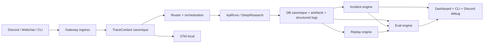

# Debug System V1 Plan

## Statut

Feuille de route canonique en cours d'execution.

Etat reel au `2026-03-17`:

- `Pack 0` implemente
- `Pack 1` implemente
- `Pack 2` implemente
- `Pack 3` implemente
- `Pack 4` partiellement implemente sur le perimetre autorise pendant le freeze:
  - `CLI`
  - `observability doctor`
  - audits locaux `privacy / retention / gates`
- `Pack 4` reste ouvert pour les branchements `dashboard / Discord debug` quand le freeze sera leve
- `Pack 5` implemente
- `Pack 6` implemente sur le perimetre `audit-only`:
  - runner d'audit final
  - rapport canonique
  - commande CLI `project-os debug discord-audit`
- la conclusion finale de `Pack 6` reste en attente du run live reel et des checks manuels apres levee explicite du freeze
- le lot complet reste ouvert tant que `Pack 4`, la conclusion finale de `Pack 6` et le pack correctif eventuel ne sont pas traites

Ce document cadre le chantier `debug + observabilite + verification` pour `Project OS`.
Il complete:

- `docs/roadmap/DISCORD_AUTONOMY_NO_LOSS_PLAN.md`
- `docs/roadmap/NATURAL_MANAGER_MODE_PLAN.md`
- `docs/roadmap/LEARNING_RUNTIME_AND_UEFN_AUTONOMY_PLAN.md`
- `docs/architecture/RUN_COMMUNICATION_POLICY.md`

Le but n'est pas d'empiler des outils de logs.
Le but est de faire de `Project OS` une machine qui ne "corrige" jamais par discours, mais seulement par preuve reproductible.

## But

Faire de `Project OS` un systeme qui:

- garde une verite canonique locale unique
- relie chaque incident a un graphe causal complet
- peut rejouer un bug reel ou documenter proprement pourquoi il ne peut pas encore etre rejoue
- refuse les sorties modele ambigues, tronquees ou invalides
- donne a la fois une surface exploitable a l'operateur et une surface exploitable a l'IA qui corrige
- ferme un incident seulement apres une preuve rouge puis une preuve verte

Regle dure du chantier:

- `incident -> reproduction rouge -> correction -> preuve verte`

## Probleme produit

Le repo est deja solide sur plusieurs briques de debug:

- DB canonique riche
- structured logs
- dashboard local
- replay OpenClaw
- no-loss audit sur les deliveries
- `eval_candidates` deja presents

Mais il manque encore la colonne vertebrale unique qui transforme ces briques en systeme de correction fiable.

Les gaps reels a fermer sont:

### 1. Beaucoup d'IDs, pas encore un seul contrat de correlation cross-surface

Le code a deja:

- `channel_event_id`
- `dispatch_id`
- `intent_id`
- `decision_id`
- `mission_run_id`
- `run_id`
- `trace_id` pour certaines traces locales

Mais il n'existe pas encore de `correlation_id` canonique, stable et cross-surface.

Risque:

- traces locales utiles mais non reliees entre elles
- debug par intuition plutot que par graphe causal
- difficultes pour l'IA a reconstruire un run sans re-ouvrir plusieurs couches a la main

### 2. Le replay existe deja, mais pas encore comme workflow canonique de correction

Le repo a deja:

- `openclaw replay`
- `truth-health`
- `validate-live`
- requeue operator delivery

Mais il manque encore:

- un point d'entree unique `debug replay`
- le lien automatique `incident -> replay fixture`
- le contrat qui rend un bug "corrigeable" seulement si la reproduction existe

### 3. Les sorties modele ne sont pas encore toutes traitees comme une frontiere hostile

Le code a deja:

- des types forts
- des tests sur `api_runs` et `deep_research`
- une discipline de structured outputs sur certaines surfaces

Mais il manque encore:

- un contrat fail-closed unifie pour refus, troncature, JSON invalide, sortie partielle, et reprise apres restart
- la standardisation `Responses API + background` sur les runs longs

### 4. Les signaux d'evals existent, pas encore le systeme canonique d'evaluation

Le repo a deja:

- `eval_candidates`
- beaucoup de tests unitaires
- des roadmaps qui ciblent `evals`

Mais il manque encore:

- `src/project_os_core/evals/`
- un registre canonique des cas
- un runner unique
- le lien systematique `incident -> eval de couverture`

### 5. La privacy est deja traitee en partie, mais pas encore comme un contrat debug complet

Le code a deja:

- `privacy_guard`
- sanitization
- `privacy_view`
- checks `openclaw doctor`

Mais il manque encore:

- TTL par classe de donnee debug
- surfaces debug separees des surfaces conversationnelles
- verification automatique de retention et de redaction

## Point de depart reel dans le repo

### Ce qui existe deja

- `src/project_os_core/database.py`
  - tables runtime, gateway, deliveries, reports, traces, memory, eval candidates
- `src/project_os_core/observability.py`
  - `StructuredLogger`
  - `write_health_snapshot()`
- `src/project_os_core/api_runs/dashboard.py`
  - dashboard local
  - beacon operateur
  - `no_loss_audit`
  - `gateway_reply_audit`
- `src/project_os_core/gateway/openclaw_live.py`
  - replay OpenClaw
  - truth health
  - validation live
- `src/project_os_core/learning/service.py`
  - stockage de `eval_candidates`
- `src/project_os_core/privacy_guard.py`
  - classification sensibilite
  - sanitization
- `tests/unit/test_openclaw_live.py`
  - couverture replay / truth health / validate live
- `tests/unit/test_api_run_dashboard.py`
  - couverture dashboard / no-loss / gateway reply audit

### Ce qui est deja prouve localement

Au moment de cette roadmap:

- `test_openclaw_live.py` passe
- `test_api_run_dashboard.py` passe

Conclusion:

- on ne part pas de zero
- on durcit, on unifie, et on transforme des briques existantes en colonne vertebrale de correction

## Principes non negociables

### Verite canonique

La verite du debug reste:

- SQLite
- artefacts
- journal local
- replay

`OpenTelemetry`, `Promptfoo`, `Sentry`, `Tempo`, `Langfuse`, `LangSmith` ou tout autre backend ne peuvent jamais devenir la verite canonique.

### Proof-driven, jamais conversation-driven

Une correction n'est jamais acceptee parce que:

- elle "a l'air juste"
- elle a bien repondu dans le chat
- le modele affirme qu'il a compris

Une correction est acceptee seulement si:

- le bug est reproduit
- la cause est reliee a des preuves
- la verification passe

### Local-first

La phase 1 doit marcher:

- sans cloud d'observabilite
- sans SaaS de tracing
- sans plateforme externe d'evals

### Surfaces separees

La surface conversationnelle reste simple.
La surface debug expose:

- IDs
- route
- provider
- model
- cout
- preuves
- diagnostics

### Fail-closed

Une sortie modele ambigue ou invalide ne doit jamais degrader silencieusement vers:

- Discord
- PDF
- persistence finale
- artefact de reference

### Idempotence obligatoire

Chaque operation critique doit pouvoir etre reexecutee sans dupliquer l'etat canonique.

Perimetre minimum:

- ingress d'evenement
- creation d'incident
- lancement de replay
- lancement d'eval
- generation de rapport
- cloture d'incident

### Reparabilite obligatoire

Tout etat derive doit pouvoir etre:

- reconstruit
- reconcilie
- marque comme orphelin
- purge proprement si necessaire

Le systeme doit pouvoir expliquer:

- ce qui est canonique
- ce qui est derive
- ce qui est re-generable
- ce qui est perdu

### Debug isole du live

Le systeme de debug ne doit pas:

- voler le budget du live
- bloquer le chemin conversationnel normal
- saturer la DB ou le disque au point de casser le runtime

Les replays, evals, exports et repairs doivent vivre avec:

- budgets dedies
- files dediees
- priorites explicites
- limites de concurrence

### Comparabilite des preuves

Une preuve verte n'a de valeur que si elle reste comparable dans le temps.

Donc chaque preuve critique doit embarquer au minimum:

- commit
- schema
- prompt ou template
- policy
- config
- provider
- model
- feature flags

## Cartographie externe et decisions

### OpenAI - Responses API, background, evals, structured outputs

Sources:

- [Migrate to Responses](https://developers.openai.com/api/docs/guides/migrate-to-responses)
- [Background mode](https://developers.openai.com/api/docs/guides/background)
- [Structured outputs](https://developers.openai.com/api/docs/guides/structured-outputs)
- [Evaluation best practices](https://developers.openai.com/api/docs/guides/evaluation-best-practices)
- [API deprecations](https://platform.openai.com/docs/deprecations/2023-03-20-codex-models%23doc)

Ce qu'on recupere:

- `Responses API` comme primitive cible pour les runs longs
- `background` pour les executions longues avec reprise
- `response_id` et `previous_response_id` comme technique d'execution, jamais comme verite canonique
- structured outputs stricts
- approche officielle `objective -> dataset -> metrics -> iterate`

Ce qu'on n'importe pas:

- aucune memoire canonique cote provider
- aucune dependance a un stockage distant comme preuve de debug
- aucune migration totale de toute la conversation Discord en phase 1

Decision:

- `ADAPT`

### OpenTelemetry - colonne vertebrale standard de traces locales

Sources:

- [Collector overview](https://opentelemetry.io/docs/collector/)
- [Collector configuration](https://opentelemetry.io/docs/collector/configuration/)
- [Python propagation](https://opentelemetry.io/docs/languages/python/propagation/)
- [Exceptions on spans](https://opentelemetry.io/docs/specs/semconv/exceptions/exceptions-spans/)

Ce qu'on recupere:

- propagation W3C `traceparent`
- Collector local
- processeurs `memory_limiter` et `batch`
- evenements d'exception standards sur les spans

Ce qu'on n'importe pas:

- aucune instrumentation massive de micro-fonctions
- aucune dependance a un backend heberge en phase 1

Decision:

- `ADAPT`

### Promptfoo - gates d'evals et red-team

Sources:

- [Promptfoo CI/CD](https://www.promptfoo.dev/docs/integrations/ci-cd/)
- [Promptfoo red-team plugins](https://www.promptfoo.dev/docs/red-team/plugins/)

Ce qu'on recupere:

- runner local pour evals et red-team
- plugins adversariaux
- quality gates et pass thresholds

Ce qu'on n'importe pas:

- Promptfoo comme source canonique des cas et resultats
- grosses suites generiques de bench avant un corpus Project OS serre

Decision:

- `ADAPT`

### Discord + CNIL - retention minimale et separation des surfaces

Sources:

- [Discord Developer Terms](https://support-dev.discord.com/hc/en-us/articles/8562894815383-Discord-Developer-Terms-of-Service)
- [Discord Developer Policy](https://support-dev.discord.com/hc/en-us/articles/8563934450327-Discord-Developer-Policy)
- [CNIL - limiter la conservation des donnees](https://www.cnil.fr/fr/limiter-la-conservation-des-donnees)

Ce qu'on recupere:

- retention minimale
- suppression des donnees non necessaires
- separation entre la surface produit et la surface debug

Decision:

- `KEEP`

### Plateformes hebergees d'observabilite

Perimetre:

- Sentry
- Tempo
- Jaeger
- Langfuse
- LangSmith

Decision:

- `DEFER` en phase 1
- possible seulement derriere une frontiere OTLP propre

## Architecture cible

## Ownership et frontieres de roadmap

Cette roadmap devient proprietaire canonique de:

- `TraceContext`
- `IncidentRecord`
- `ReplayProof`
- `src/project_os_core/evals/` pour la v1
- les commandes `project-os debug *`
- les gates de correction et de verification

Les autres roadmaps peuvent:

- consommer `src/project_os_core/evals/`
- proposer des suites ou cas additionnels
- brancher leurs surfaces metier sur les contrats poses ici

Les autres roadmaps ne doivent pas:

- redefinir un autre package evals canonique
- redefinir un autre contrat de correlation
- redefinir une autre machine d'etats d'incident

Regle:

- une seule roadmap possede le substrat
- les autres roadmaps branchent dessus

## Migration, backfill et compatibilite

La robustesse de cette roadmap depend aussi de la transition.

Il faut donc prevoir explicitement:

- ajout progressif des nouvelles colonnes et tables
- backfill des references quand l'information historique existe deja
- etats `unknown` ou `missing` explicites quand le backfill est impossible
- compatibilite de lecture pendant la transition entre ancien et nouveau schema
- migrations reversibles tant que les gates sont en shadow mode

Backfill minimum a prevoir:

- liaisons entre `channel_event_id`, `dispatch_id`, `decision_id`, `mission_run_id`, `run_id`
- references de `response_id` historiques quand elles existent deja dans les payloads
- marquage des preuves anciennes comme:
  - `legacy`
  - `incomplete_provenance`
  - `needs_reverification`

## Taxonomie des IDs

Avant toute propagation de `TraceContext`, il faut figer la semantique des IDs deja presents.

Objectif:

- eviter qu'un nouvel ID de correlation ajoute une ambiguite au lieu de la resoudre

IDs a distinguer explicitement:

- `channel_event_id`
  - identifiant canonique d'un evenement entrant cote surface
- `dispatch_id`
  - identifiant de dispatch gateway
- `intent_id`
  - identifiant de l'intention routable
- `decision_id`
  - identifiant de la decision de routage
- `routing_trace_id`
  - identifiant de trace du routeur local
- `mission_run_id`
  - identifiant de run missionnel cote orchestration
- `run_id`
  - identifiant de run `api_runs`
- `correlation_id`
  - identifiant transversal unique pour relier tout le tour end-to-end

Regle:

- `correlation_id` ne remplace pas les IDs metier existants
- il les relie

## Filiation causale

Un `correlation_id` seul ne suffit pas pour un graphe causal complet.

La roadmap doit donc poser un mecanisme explicite de filiation, au choix selon la couche:

- `parent_correlation_id`
- `parent_span_id`
- ou une table locale `trace_edges`

But:

- reconstruire cause -> consequence
- distinguer fan-out, retries, handoffs et replays
- rendre les diagnostics et comparaisons non ambigus apres restart ou concurrence

## Contrats canoniques a poser

### `TraceContext`

But:

- une enveloppe unique qui relie tout un tour end-to-end

Champs minimums:

- `correlation_id`
- `surface`
- `channel`
- `thread_id`
- `conversation_key`
- `channel_event_id`
- `dispatch_id`
- `intent_id`
- `decision_id`
- `mission_run_id`
- `run_id`
- `phase`
- `created_at`
- `otel_trace_id`
- `otel_span_id`

### `IncidentRecord`

But:

- contrat unique de triage, de correction et de cloture

Champs minimums:

- `incident_id`
- `severity`
- `status`
- `symptom`
- `root_cause_hypothesis`
- `fix_summary`
- `verification_refs`
- `correlation_id`
- `replay_fixture_id`
- `eval_case_id`
- `created_at`
- `resolved_at`

Etat canonique minimal:

- `open`
- `triaged`
- `repro_ready`
- `fix_in_progress`
- `verified`
- `closed`
- `non_reproducible`

Regles:

- un incident ne peut pas passer a `verified` sans replay ou eval vert
- un incident ne peut pas passer a `closed` sans references de verification
- `non_reproducible` est un etat explicite, pas un oubli

### `EvalCase`

But:

- un cas canonique de preuve executable

Champs minimums:

- `eval_case_id`
- `suite`
- `scenario`
- `target_system`
- `expected_behavior`
- `grader_kind`
- `source_ids`
- `created_at`

### `EvalRun`

But:

- execution tracee d'un cas d'eval

Champs minimums:

- `eval_run_id`
- `eval_case_id`
- `result`
- `score`
- `artifacts`
- `trace_refs`
- `created_at`

### `ReplayProof`

But:

- preuve qu'une reproduction est disponible, executee, et reliee a un incident

Champs minimums:

- `replay_proof_id`
- `fixture_id`
- `target_id`
- `target_kind`
- `result`
- `evidence_refs`
- `created_at`

## Matrice d'integrite minimale

La roadmap doit expliciter ce qui doit devenir impossible ou visible immediatement.

Invariants minimums:

- aucun `gateway_dispatch_result` sans `channel_event_id`
- aucun `routing_decision_trace` sans `decision_id`
- aucun `api_run_event` sans `run_id`
- aucun `IncidentRecord` ferme sans `verification_refs`
- aucun `ReplayProof` vert sans cible resolue
- aucun `EvalRun` vert sans `EvalCase`
- aucun pointeur d'artefact sans checksum verifie ou statut explicite d'absence

Quand une contrainte SQL immediate est trop risquee:

- ajouter un check applicatif bloquant
- ajouter un `doctor` de coherence
- ajouter un repair automatique ou semi-automatique

## Matrice de retention minimale

La roadmap doit inclure une matrice explicite par classe de donnee.

Champs attendus par entree:

- table ou artefact
- type de contenu
- TTL
- niveau de redaction
- surface autorisee
- policy de purge
- statut de preuve apres expiration

Classes minimales:

- message brut conversationnel
- structured logs debug
- traces de replay
- resultats d'evals
- incidents
- artefacts de dead-letter
- agregats derives sans contenu brut

Regle:

- quand le brut expire mais que la preuve doit rester, conserver un tombstone ou un substitut sanitise

## Flux cible

## Packs coeur

Note de perimetre:

- le `debug live Discord` actuellement en cours de stabilisation ne fait pas partie du chantier direct des packs `0 -> 5`
- ce perimetre est audite en fin de roadmap dans `Pack 6`
- si l'audit final revele un ecart reel, on ouvre ensuite un pack supplementaire dedie aux corrections du debug Discord
- le `bot live Discord` et l'`app / dashboard` actuellement en cours de creation sont geles jusqu'a readiness explicite de leurs chantiers propres
- aucun pack `Debug System v1` ne doit les refondre, les rebrancher ou les forcer tant que ce freeze n'est pas leve
- tant que ce freeze est actif, les ajouts `Debug System v1` restent limites au socle local:
  - schema
  - CLI
  - traces
  - replay
  - incidents
  - evals
  - doctor
  - retention
  - gates

### Pack 0 - Taxonomie des IDs, filiation causale, invariants DB, quarantine des sorties invalides

But:

- eviter le chaos semantique avant d'ajouter de nouveaux contrats de trace

Travaux:

- figer la taxonomie des IDs dans `models.py`, `database.py` et les docs
- distinguer clairement `run_id` de `mission_run_id`, `dispatch_id`, `routing_trace_id` et `correlation_id`
- ajouter la filiation causale:
  - `parent_correlation_id`
  - `parent_span_id`
  - ou table `trace_edges`
- renforcer les invariants DB:
  - contraintes d'integrite quand elles sont compatibles avec le schema existant
  - checks de coherence applicatifs la ou une contrainte SQL immediate serait trop risquee
- ajouter une quarantine canonique pour:
  - sorties modele JSON invalides
  - sorties tronquees
  - payloads de preuve non chargeables
  - artefacts de debug incomplets
- poser les marqueurs de transition:
  - `legacy`
  - `unknown`
  - `missing`
  - `incomplete_provenance`

Touchpoints principaux:

- `src/project_os_core/models.py`
- `src/project_os_core/database.py`
- `src/project_os_core/api_runs/service.py`
- `src/project_os_core/deep_research.py`
- `src/project_os_core/gateway/service.py`

Preuves a obtenir:

- plus aucune ambiguite documentaire sur les IDs coeur
- une sortie invalide ne traverse jamais la frontiere de persistence finale sans entrer en quarantine
- les chemins coeur detectent les etats relationnels invalides plus tot qu'au triage humain

Critere d'acceptation:

- le graphe causal est definissable sans surcharger `correlation_id`

### Pack 1 - Correlation spine locale, debug trace, couverture via SQLite/logs/CLI

But:

- rendre chaque run lisible et reconstruisible localement avant toute dependance OTel

Travaux:

- ajouter `TraceContext`
- propager `correlation_id` dans:
  - `gateway`
  - `router`
  - `api_runs`
  - `session`
  - `memory`
  - `operator deliveries`
  - artefacts
- enrichir `StructuredLogger`
- ajouter `project-os debug trace <correlation_id>`
- ajouter les requetes et vues locales necessaires pour reconstruire un tour complet depuis SQLite, logs et CLI
- traiter `OpenTelemetry` comme un sous-lot `1b`, pas comme prerequis d'acceptation du lot local
- ajouter un `sequence_number` ou equivalent sur les chaines causales quand l'ordre strict compte
- utiliser UTC pour l'audit et temps monotone pour durees, retries et timeouts

Touchpoints principaux:

- `src/project_os_core/observability.py`
- `src/project_os_core/database.py`
- `src/project_os_core/gateway/service.py`
- `src/project_os_core/router/service.py`
- `src/project_os_core/api_runs/service.py`
- `src/project_os_core/session/state.py`
- `src/project_os_core/memory/os_service.py`
- `src/project_os_core/cli.py`

Preuves a obtenir:

- un meme `correlation_id` visible dans DB, logs, artefacts et deliveries
- un diagnostic complet faisable via SQLite + logs + CLI

Critere d'acceptation:

- plus de `95%` des flux coeur portent le meme `correlation_id` sur les artefacts attendus

### Pack 2 - Replay canonique, reprise background, idempotence et dead letters multi-domaines

But:

- transformer les bugs en objets rejouables, donc corrigables

Travaux:

- recentrer la migration `Responses` sur:
  - `background`
  - reprise apres restart
  - taxonomie des statuts terminaux
  - persistence locale de `response_id`
- standardiser `project-os debug replay <correlation_id|dispatch_id|run_id>`
- reutiliser le replay OpenClaw existant comme moteur cross-surface prioritaire
- ajouter des cles d'idempotence pour:
  - creation d'incident
  - lancement d'eval
  - generation de rapport
  - replay
  - cloture d'incident
- etendre les dead letters au-dela des operator deliveries:
  - sorties modele invalides
  - replays casses
  - eval runs incomplets
  - preuves non chargeables
- poser un budget et une file separes pour:
  - replay
  - evals
  - export

Touchpoints principaux:

- `src/project_os_core/api_runs/service.py`
- `src/project_os_core/deep_research.py`
- `src/project_os_core/session/state.py`
- `src/project_os_core/gateway/openclaw_live.py`
- `src/project_os_core/cli.py`

Preuves a obtenir:

- un run long interrompt puis relance reprend via `response_id`
- un replay peut etre invoque depuis un `correlation_id` sans recherche manuelle multi-table
- les echec multi-domaines finissent en dead-letter canonique, pas en trou silencieux

Critere d'acceptation:

- tout bug critique rejouable ou documente non rejouable avec raison explicite

### Pack 3 - Incident engine, substrat evals unique et provenance

But:

- empecher le yes-man et rendre chaque correction comparable dans le temps

Travaux:

- ajouter `IncidentRecord` avec machine d'etats canonique
- ajouter les tables d'incidents et de verification
- creer `src/project_os_core/evals/` comme substrat canonique unique pour la v1
- clarifier dans la doc que cette roadmap possede le substrat `evals`, et que les autres roadmaps le consomment
- reutiliser `eval_candidates` comme source d'alimentation amont
- definir la suite coeur `core-debug`
- y mettre d'abord:
  - conformite JSON stricte
  - dates absolues
  - refus surs
  - absence de fuite inter-session
  - golden transcripts Discord
  - stabilite replay
  - resume operateur en francais clair
- ajouter une provenance forte sur chaque preuve:
  - commit
  - prompt ou template
  - schema
  - policy
  - config
  - flags
  - provider
  - model
- integrer `Promptfoo` comme runner externe optionnel de gates, sans lui donner le canon des cas
- ajouter une definition de cloture d'incident:
  - repro rouge observee
  - correction liee
  - preuve verte observee
  - provenance complete

Touchpoints principaux:

- `src/project_os_core/database.py`
- `src/project_os_core/models.py`
- `src/project_os_core/learning/service.py`
- `src/project_os_core/api_runs/service.py`
- `src/project_os_core/gateway/service.py`
- `src/project_os_core/cli.py`
- `tests/unit/`

Preuves a obtenir:

- un lien explicite `incident -> replay -> eval -> fix`
- chaque bug reel alimente au moins un cas d'eval ou de replay de couverture
- une preuve verte reste comparable a travers les versions grace a la provenance

Critere d'acceptation:

- aucune correction critique n'est consideree terminee sans reference a une preuve executable

### Pack 4 - Dashboard, Discord debug, privacy TTL, gates progressifs

But:

- rendre le systeme operable et vivable en vrai

Freeze actif:

- le `bot live Discord` est gele jusqu'a stabilisation explicite de son chantier propre
- l'`app / dashboard` est gelee jusqu'a ce que sa surface soit declaree prete a recevoir les branchements debug
- tant que ce freeze reste actif, `Pack 4` ne doit pas modifier ces surfaces
- pendant ce freeze, `Pack 4` est limite a:
  - `project-os observability doctor`
  - audits de retention / privacy / gates
  - surfaces CLI et rapports locaux non invasifs
  - preparation documentaire des integrations futures

Travaux:

- ajouter au dashboard:
  - `trace waterfall`
  - `incidents`
  - `replay health`
  - `eval health`
  - `dead letters`
  - `delivery health`
- ajouter au CLI:
  - `project-os debug incidents`
  - `project-os eval run --suite core-debug`
  - `project-os observability doctor`
- definir une surface Discord debug dediee
- garder la surface conversationnelle normale propre
- mettre les gates en deux temps:
  - shadow mode
  - blocage progressif
- figer une matrice de retention concrete par classe de donnee:
  - table ou artefact
  - TTL
  - niveau de redaction
  - surface autorisee
- ajouter des checks automatiques de:
  - redaction
  - `privacy_view`
  - retention
  - exposition de donnees sensibles
- ajouter des kill switches fins:
  - par surface
  - par canal
  - par mode
  - par gate
  - par export

Touchpoints principaux:

- `src/project_os_core/api_runs/dashboard.py`
- `src/project_os_core/cli.py`
- `src/project_os_core/privacy_guard.py`
- `src/project_os_core/gateway/service.py`
- `src/project_os_core/gateway/openclaw_live.py`
- `docs/architecture/RUN_COMMUNICATION_POLICY.md`

Preuves a obtenir:

- le dashboard et le CLI permettent de diagnostiquer un run sans ouvrir des JSON bruts
- les surfaces debug n'exposent pas les secrets ou donnees sensibles non redigees
- la retention et la redaction sont verifiables table par table et artefact par artefact

Critere d'acceptation:

- la surface humaine reste calme
- la surface debug est suffisante pour le triage reel

### Pack 5 - Resilience systeme

But:

- faire en sorte que le systeme de debug reste fiable quand le systeme lui-meme degrade

Travaux:

- definir un protocole de crash consistency DB <-> artefacts
- ajouter des politiques reelles de backpressure:
  - priorites
  - shedding
  - pause
  - circuit breaker
- isoler les charges debug du chemin live:
  - replay
  - evals
  - exports
- ajouter des outils de reparabilite:
  - `project-os debug reconcile`
  - `project-os debug orphan-scan`
  - `project-os observability doctor --repair`
- definir les etats de preuve perissable:
  - `proof_stale`
  - `needs_reverification`
- formaliser la machine de degradation:
  - provider indisponible
  - Discord indisponible
  - DB lockee
  - disque plein
  - pipeline OTel casse
- ajouter des tests de panne intentionnelle:
  - kill process en plein write
  - disque plein
  - DB locked
  - double event
  - sortie partielle
  - restart en boucle
- definir la cadence de drills:
  - smoke frequent
  - panne intentionnelle reguliere
  - revue des repairs apres incident

Touchpoints principaux:

- `src/project_os_core/database.py`
- `src/project_os_core/api_runs/service.py`
- `src/project_os_core/gateway/service.py`
- `src/project_os_core/gateway/openclaw_live.py`
- `src/project_os_core/cli.py`
- `tests/unit/`
- `tests/integration/`

Preuves a obtenir:

- le chemin live reste prioritaire sous saturation
- un crash ne laisse pas de pointeurs ou preuves dans un etat silencieusement incoherent
- les vues derivees peuvent etre reparees ou reconciliees

Critere d'acceptation:

- le systeme de debug ne devient pas lui-meme la panne principale

### Pack 6 - Audit final du debug live Discord

But:

- verifier en fin de roadmap que le debug live Discord stabilise est coherent avec la vision facade Discord
- verifier qu'il ne regress pas apres les packs systeme
- decider explicitement s'il faut ouvrir un pack supplementaire de correction

Prerequis:

- le freeze du `bot live Discord` et de l'`app / dashboard` a ete leve par leurs chantiers propres
- la surface a auditer est consideree assez stable pour etre jugee contre la vision cible

Nature du pack:

- c'est un audit final avant correction eventuelle
- ce n'est pas un pack de refonte du debug live Discord
- le debug live Discord reste porte par son chantier propre tant que cet audit final n'a pas conclu

Perimetre d'audit:

- fuite ou non-fuite de tuyauterie
- disclosure provider/modele sur demande seulement
- preservation des flows proteges `Deep Research`
- confirmations de switch modele et cost gate
- continuite de thread et de PDF/artefact
- `go` sans approval en attente
- ton persona et facade Discord

Outils d'audit a utiliser:

- `project-os debug discord-audit`
- `python scripts/discord_facade_smoke.py`
- `python scripts/project_os_tests.py --suite discord-facade-live`
- `python scripts/project_os_tests.py --suite discord-persona-live`
- scenarios `manual/live acceptance` du harness

Commande canonique:

- `project-os debug discord-audit` lit un rapport existant et rend un verdict `coherent / non_coherent / inconclusive`
- `project-os debug discord-audit --run-live --layer smoke --layer persona` execute le harness cheap `Haiku`, produit un rapport canonique et prepare l'audit final sans toucher au bot ou a l'app
- tant que le freeze n'est pas leve ou que les checks manuels restent `pending`, le verdict doit rester `inconclusive`

Touchpoints principaux:

- `scripts/discord_facade_smoke.py`
- `scripts/project_os_tests.py`
- `src/project_os_core/gateway/discord_facade_smoke.py`
- `tests/unit/test_discord_facade_smoke.py`
- `tests/unit/test_gateway_persona.py`

Sorties attendues:

- rapport `PASS / FAIL / REGRESSION / FALSE POSITIVE`
- liste des ecarts entre le debug live observe et la vision produit
- decision explicite:
  - `debug live Discord coherent avec la vision`
  - ou `ouvrir un pack supplementaire de correction du debug Discord`

Regle:

- si l'audit est vert ou acceptable avec ecarts connus, la roadmap `Debug System v1` peut etre cloturee sans modifier le debug live Discord
- si l'audit n'est pas acceptable, on ouvre un pack supplementaire dedie, borne par les constats de l'audit

Rappel a relire avant de cloturer `Pack 6`:

- ne pas oublier de relancer `project-os debug discord-audit --run-live --layer smoke --layer persona --allow-missing-anthropic` quand le chantier Discord est stabilise
- ne pas oublier de completer les checks `manual/live acceptance` puis de relancer `project-os debug discord-audit --manual-status-path ... --freeze-lifted`
- tant que le verdict reste `inconclusive`, `Pack 6` n'est pas termine
- si le verdict devient `non_coherent`, on n'improvise pas de patch flou: on ouvre le `Pack supplementaire - Corrections du debug live Discord`
- si le verdict devient `coherent`, `Pack 6` peut etre cloture proprement

Critere d'acceptation:

- le debug live Discord est explicitement qualifie conforme ou non conforme a la vision
- tout besoin de correction ouvre un pack dedie plutot qu'une derive floue dans les packs precedents

## Extensions fonctionnelles optionnelles

### Extension A - Remote export et triage heberge

But:

- rendre possible plus tard un export OTLP vers:
  - Sentry
  - Tempo
  - Jaeger
  - Langfuse
  - LangSmith

Regles:

- desactive par defaut
- documente comme UX de triage seulement
- aucune plateforme externe ne devient la verite canonique

Decision:

- apres la v1 locale

### Extension B - Auto-learning de correction

But:

- aider l'IA a corriger l'IA a partir de preuves deja verifiees

Fonctions cibles:

- regrouper incidents similaires
- suggerer replay ou eval manquants
- proposer des `fix patterns`
- remonter les trous de verification

Regles:

- alimente seulement avec:
  - incidents verifies
  - cas verts
  - corrections closes
- jamais avec de simples conversations

Decision:

- apres la mise en place du socle de preuves

## KPIs, gates et preuves exigees

## Rollout et activation

La roadmap doit etre activee en plusieurs etapes pour eviter qu'un gate immature casse le live.

Etapes:

- `stage 0`
  - schema et contrats poses
  - zero blocage live
- `stage 1`
  - collecte des signaux
  - dashboards et CLI
  - shadow mode
- `stage 2`
  - gates techniques coeur
  - blocage seulement sur cas a forte confiance
- `stage 3`
  - blocage complet des fermetures critiques sans preuve

Chaque stage doit avoir:

- feature flags explicites
- kill switch instantane
- rollback de config
- owner de decision

### KPIs coeur

- couverture de correlation `>95%`
- taux de bugs critiques rejouables en hausse continue
- temps median de triage en baisse
- zero promotion silencieuse de sorties invalides
- chaque bug reel converti en cas de preuve
- baisse des preuves orphelines ou perimees
- temps de reparation apres panne de debug mesurable

### Gates progressifs

#### Gate 0 - Shadow mode

- pas de blocage merge
- mesure seulement des trous

#### Gate 1 - Smoke technique obligatoire

- traces coeur presentes
- replay de base vert
- outputs structures valides

#### Gate 2 - Correction critique preuvee

- aucun `P0/P1` ferme sans incident
- aucun incident critique ferme sans replay ou eval vert

### Cas de test minimums

- propagation de `TraceContext`
- erreur forcee avec event `exception`
- restart au milieu d'un run long
- replay depuis `correlation_id`
- JSON invalide refuse
- refus explicite refuse
- sortie tronquee refusee
- redaction et `privacy_view` verifies
- backpressure et dead letters verifies
- crash consistency DB <-> artefacts verifiee
- reconcile / orphan-scan verifies
- kill switch de gate verifie
- provenance de preuve verifiee
- ordre causal et sequence verifies

## Definition de done

Le chantier n'est pas "fini" quand les tables existent.

Il est fini seulement quand:

- les contrats sont poses dans le code
- les migrations sont executees
- les commandes CLI existent
- les dashboards exposent les bons diagnostics
- les tests unitaires passent
- les tests d'integration critiques passent
- les chaos tests minimums passent
- les kill switches sont testes
- la checklist du lot est a jour
- au moins un incident reel ou synthetique parcourt toute la boucle `rouge -> vert`

## Ce qu'il ne faut pas faire

- ne pas remplacer la DB canonique par une plateforme de traces
- ne pas instrumenter chaque micro-fonction
- ne pas fermer un incident sur la base d'une explication narrative
- ne pas lancer une enorme plateforme d'evals avant un seed set Project OS serre
- ne pas exposer provider, cout ou IDs dans la conversation normale par defaut

## Integration dans la checklist

Le document doit apparaitre dans `BUILD_STATUS_CHECKLIST.md` sous un lot unique:

- `Lot Debug System v1`
  - `Pack 0 - Taxonomie des IDs, filiation causale, invariants DB, quarantine des sorties invalides`
  - `Pack 1 - Correlation spine locale, debug trace, couverture via SQLite/logs/CLI`
  - `Pack 2 - Replay canonique, reprise background, idempotence et dead letters multi-domaines`
  - `Pack 3 - Incident engine, substrat evals unique et provenance`
  - `Pack 4 - Dashboard, Discord debug, privacy TTL, gates progressifs`
  - `Pack 5 - Resilience systeme`
  - `Pack 6 - Audit final du debug live Discord`
  - `Pack supplementaire - Corrections du debug live Discord (si l'audit final l'exige)`

Les extensions doivent apparaitre dans une section separee:

- `Extension A - Remote export et triage heberge`
- `Extension B - Auto-learning de correction`

## Hypotheses figees

- phase 1 sans SaaS obligatoire
- client principal du systeme: `IA + humain`
- `Responses API` limite aux runs longs et aux sorties structurees a haut risque en v1
- `Promptfoo` complete les tests internes, il ne remplace pas le package `evals`
- le debug optimal pour `Project OS` est d'abord un systeme de preuves locales
