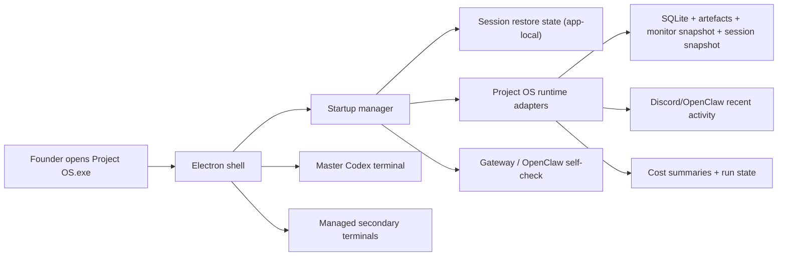

# Project OS Desktop Control Room V1 Plan

## Statut

Feuille de route canonique posee.

Etat reel courant:

- `Pack 0` est fige dans la documentation canonique
- `Pack 1` a une premiere fondation repo posee:
  - service local `desktop control room`
  - persistence `workspace_state`
  - payload `startup-status`
  - shell `Electron` minimal
  - tests Python cibles verts
- `Pack 2` a une premiere fondation UI posee:
  - coque desktop `Electron` lisible
  - onglets `Home/Session/Runs/Discord/Costs/Terminals/Settings`
  - `Home` par defaut
  - langage visuel desktop v1
  - ligne discrete `Codex usage`
- `Pack 3` a une premiere fondation runtime UI posee:
  - terminal maitre `Codex` restaure dans la coque desktop
  - terminaux secondaires lances par presets controles
  - tabs de terminaux ancres dans la zone basse
  - voie de test locale immediate via `npm.cmd start`
- `Pack 4` a une premiere couche d'adaptation stable posee:
  - payload runtime normalise par vues
  - sorties CLI `runtime-payload` et `screen-payload`
  - renderer branche sur les adapters et non sur le runtime brut
  - tests Python cibles verts sur le contrat
- `Pack 5` a une premiere couche UX lisible posee:
  - resumes par ecran en langage operateur
  - bandes de synthese et etats vides lisibles
  - preuve live Discord mieux cadre
  - vues coeur orientees questions plutot que JSON
- `Pack 6` a une premiere couche health/degraded posee:
  - contrat startup avec cartes `ok / warning / error`
  - actions de reprise `refresh / restart gateway / reopen master terminal / reset layout`
  - fallback renderer lisible si le payload runtime echoue
  - tests Python cibles verts sur le mode degrade
- le packaging `.exe` reste une etape de build distincte

Ce document cadre le chantier `app desktop Windows + control room local + terminaux maitrises` pour `Project OS`.
Il complete:

- `docs/roadmap/DISCORD_AUTONOMY_NO_LOSS_PLAN.md`
- `docs/roadmap/DISCORD_MEETING_OS_PLAN.md`
- `docs/roadmap/DEBUG_SYSTEM_V1_PLAN.md`
- `docs/architecture/RUN_COMMUNICATION_POLICY.md`
- `docs/roadmap/DISCORD_FOUNDER_SURFACE_REPAIR_V2_PLAN.md`

Le but n'est pas de remplacer `Discord`, ni de dupliquer l'app `Codex`.
Le but est de donner au fondateur une vraie surface locale quotidienne, lisible, stable et belle, qui ouvre `Project OS` comme un produit a part entiere.

Position produit explicite:

- le futur `.exe` `Project OS` doit etre visible tres tot dans le projet
- il doit etre presente comme la future entree locale pilotable principale
- `Discord` reste une branche de discussion et de travail distante/parallele
- `Discord` n'est pas le cockpit runtime par defaut
- la visibilite du `.exe` doit apparaitre:
  - dans la roadmap
  - dans la checklist build
  - et en premiere page de la documentation racine quand la base desktop est posee

## But

Faire de `Project OS` un systeme qui:

- s'ouvre chaque matin comme une app bureau Windows dediee au projet
- restaure un contexte de travail local utile sans demander de fouiller `runtime/`
- expose un terminal maitre fixe pour la conversation et le codage avec `Codex`
- montre clairement l'etat des runs, du gateway, des couts et des activites distantes
- montre de maniere discrete l'usage et les limites restantes utiles du lane `Codex` quand le signal local est disponible
- garde `Discord` comme surface utile et parallele, sans imposer une fusion prematuree des conversations
- fonctionne d'abord sur la verite locale et presque jamais par appels modele pour son UI

Regle produit dure du chantier:

- `app first pour l'humain, local truth pour la machine, Discord parallele sans sync de chat en v1`

## Ce que l'app est et n'est pas

### Ce que l'app est

- la surface locale principale du fondateur
- la future entree `.exe` visible et assumee du projet cote local
- un control room Windows-first
- un conteneur desktop autour du runtime existant
- un point d'entree stable pour `Codex`, `OpenClaw`, les runs et les preuves locales

### Ce que l'app n'est pas

- un clone de `Discord`
- un clone de l'app `Codex`
- une nouvelle source de verite a cote de SQLite et des artefacts
- un observability center complet en v1
- un systeme de sync de conversation `Discord <-> app <-> Codex` en v1
- une app mobile ou de teleoperation distante en v1

## Probleme produit

Aujourd'hui, `Project OS` a deja beaucoup de briques solides:

- DB canonique locale
- snapshots de session
- dashboard web local
- monitor texte local
- gateway `OpenClaw`
- audits de deliveries
- replay et validation live
- surface `Discord` deja riche

Mais il manque encore une vraie surface locale fondatrice qui fasse systeme.

Le workflow actuel laisse encore trop de friction sur quatre points.

### 1. La verite locale existe, mais la surface fondatrice locale n'existe pas encore comme produit

Le repo a deja:

- `api_runs dashboard`
- `monitor_snapshot()`
- `render_terminal_dashboard()`
- `PersistentSessionState`

Mais il manque encore:

- une app desktop Windows a lancer depuis le bureau
- une UX unifiee autour du contexte, du terminal maitre et des panneaux secondaires
- un demarrage "j'allume le PC, je reprends ou j'en etais"
- une visibilite simple sur le budget d'usage `Codex` restant si la source locale existe

Risque:

- surface locale utile mais eclatee
- trop de dependance mentale a plusieurs fenetres et scripts
- sentiment que `Project OS` n'est pas encore un produit complet

### 2. Le terminal est crucial, mais pas encore maitrise comme composant de produit

Le systeme a deja:

- `Codex` comme voie locale de travail humain
- du monitoring texte
- des commandes CLI pour le gateway, les runs et le debug

Mais il manque encore:

- un terminal maitre fixe dans l'interface
- une gestion propre des terminaux secondaires
- une politique de placement et de restauration robuste

Risque:

- multiplication de fenetres sauvages
- perte du contexte operateur
- perception d'un systeme "bricole" alors que le coeur est deja solide

### 3. Le dashboard web local existe, mais pas encore une UX desktop lisible pour un humain non technique

Le systeme a deja:

- des donnees de runs
- des donnees de couts
- des donnees `Discord/OpenClaw`
- un dashboard HTML existant

Mais il manque encore:

- une hierarchie visuelle fondateur-first
- des onglets simples
- des cartes de statut et d'alerte comprehensibles sans lire des JSON
- une micro-surface d'usage/limite `Codex` visible sans polluer l'ecran

Risque:

- une surface trop technique
- un gain reel de supervision trop faible par rapport a ouvrir `Discord + terminal + navigateur`

### 4. Le systeme distant et les agents existent, mais leur place dans la surface locale n'est pas encore figee

Le systeme a deja:

- `Discord` comme cockpit conversationnel
- `OpenClaw` comme facade/gateway
- des runs API et de l'activite distante

Mais il manque encore:

- une doctrine claire sur ce qui remonte dans l'app
- une distinction nette entre:
  - travail humain `Codex`
  - travail agents externes/API
  - etat runtime de fond

Risque:

- UI confuse
- couts invisibles
- sync prematuree et fragile entre surfaces

## Point de depart reel dans le repo

### Ce qui existe deja

- `src/project_os_core/api_runs/dashboard.py`
  - dashboard web local
  - payload dashboard
  - audit `gateway_reply_audit`
- `src/project_os_core/api_runs/service.py`
  - `monitor_snapshot()`
  - `render_terminal_dashboard()`
  - calculs de couts
  - verifications operateur
- `src/project_os_core/session/state.py`
  - `PersistentSessionState`
  - resume local de la session
- `src/project_os_core/gateway/service.py`
  - persistences conversationnelles
  - activite `Discord/OpenClaw`
  - surfaces reply / manifests
- `src/project_os_core/gateway/openclaw_live.py`
  - `replay`
  - `truth-health`
  - `validate-live`
- `src/project_os_core/cli.py`
  - commandes `api-runs`, `openclaw`, `gateway`, `router`
- `scripts/project_os_api_dashboard.ps1`
  - lancement du dashboard existant
- `scripts/project_os_openclaw_watchdog.ps1`
  - supervision locale `OpenClaw`

### Ce qui est deja prouve localement

Le repo sait deja:

- calculer un snapshot de session et de runs localement
- calculer des couts sans appel LLM
- exposer un dashboard local
- superviser `OpenClaw`
- rejouer et auditer des flux live

Conclusion:

- on ne part pas d'une page blanche
- la v1 doit emballer, simplifier et fiabiliser ce qui existe
- la v1 ne doit pas reconstruire un backend parallele

## Principes non negociables

### App-first, pas app-only

L'app desktop devient la surface locale principale du fondateur.
Mais `Discord` reste une autre facon legitime de travailler.

Regle supplementaire issue du chantier `Discord Founder Surface Repair v2`:

- quand `Discord` parle de detail operatoire, il doit desormais handoff vers `Project OS.exe`
- les vues desktop de destination par defaut sont:
  - `Home`
  - `Session`
  - `Runs`
  - `Discord`
  - `Costs`

### Local truth, jamais UI truth

La verite reste:

- SQLite
- artefacts
- snapshots
- journaux locaux
- replay

L'app desktop ne devient jamais la source de verite.

### Codex master lane

Le terminal maitre de l'app porte la voie de travail humain principale:

- `Codex`
- repo local
- terminal fixe

### No shared chat sync in v1

La v1 n'essaie pas de faire croire que:

- parler dans `Discord`
- parler dans l'app
- parler dans `Codex`

est exactement la meme conversation machine.

On expose des etats et activites communes.
On ne promet pas une fusion de chat encore fragile.

### Almost zero idle API cost

L'app:

- lit l'etat local
- rafraichit des payloads locaux
- n'appelle pas de modele pour dessiner son UI

### Beauty by clarity

`Magnifique` en v1 veut dire:

- une vraie identite visuelle
- une hierarchie de lecture calme
- une lisibilite immediate
- un produit fondateur-first

Pas:

- une interface surchargee
- une copie trop ambitieuse des mockups

## Cible produit v1

Quand le fondateur allume son PC:

1. il clique sur `Project OS`
2. l'app s'ouvre
3. elle restaure son contexte local utile
4. elle verifie ou demarre proprement le gateway
5. elle lance un check de sante leger
6. elle affiche clairement:
   - l'etat courant
   - le cout courant
   - l'etat d'usage/limite `Codex` si disponible
   - les runs actifs
   - l'activite distante recente
7. le terminal maitre est deja la
8. les panneaux secondaires peuvent etre ouverts sans chaos visuel

## Architecture cible

## Contrats canoniques a poser

### `DesktopWorkspaceState`

But:

- restaurer l'espace de travail local sans polluer la verite runtime

Champs minimums:

- `workspace_state_id`
- `last_active_tab`
- `last_selected_workspace_root`
- `terminal_layout_mode`
- `preferred_monitor_mode`
- `selected_run_id`
- `selected_thread_key`
- `persistent_panel_ids`
- `updated_at`

### `StartupHealthState`

But:

- rendre le demarrage lisible et testable

Champs minimums:

- `startup_run_id`
- `gateway_status`
- `runtime_paths_status`
- `session_restore_status`
- `dashboard_source_status`
- `master_terminal_status`
- `warnings`
- `actions`
- `created_at`

### `TerminalRole`

But:

- standardiser les terminaux ouverts par l'app

Roles minimums:

- `master_codex`
- `gateway_live`
- `logs_live`
- `git_tools`
- `test_runner`
- `special_run`

### `DesktopRuntimePayload`

But:

- alimenter l'UI sans logique cachee cote renderer

Sous-payloads minimums:

- `home_summary`
- `session_summary`
- `recent_runs`
- `discord_activity`
- `cost_summary`
- `codex_usage_status`
- `startup_health`

## Packs coeur

### Pack 0 - Product contract + non-goals + surface doctrine

But:

- figer ce que l'app doit etre avant de coder l'interface

Travaux:

- figer `app first` comme voie humaine locale
- figer `Discord parallele` comme doctrine v1
- figer `Codex master lane`
- figer `no shared chat sync in v1`
- figer `idle cost quasi nul`
- figer `beauty by clarity`
- ajouter une section explicite `ce que l'app est / n'est pas`

Preuves a obtenir:

- aucune ambiguite sur la relation entre app, `Discord`, `Codex` et runtime
- aucun pack v1 ne depend d'une sync de conversation partagee

Critere d'acceptation:

- la roadmap est decision-complete sur le contrat produit

### Pack 1 - Startup spine + session restore

But:

- faire du demarrage matinal un workflow fiable et reproductible

Travaux:

- definir le workflow `launch -> restore -> self-check -> ready`
- poser `DesktopWorkspaceState`
- restaurer:
  - dernier onglet
  - dernier workspace
  - layout terminal
  - focus run/thread
- verifier ou lancer proprement `OpenClaw/gateway`
- lancer un debug / health check leger
- rendre le demarrage idempotent

Touchpoints principaux:

- future app desktop package
- `src/project_os_core/session/state.py`
- `src/project_os_core/gateway/openclaw_live.py`
- `src/project_os_core/cli.py`

Preuves a obtenir:

- relancer l'app deux fois ne cree pas de duplicats de processus coeur
- si l'etat de restore est corrompu, l'app retombe sur un mode propre
- le fondateur retrouve un contexte local utile sans manipulations manuelles

Critere d'acceptation:

- `cold start`, `warm start` et `degraded start` sont lisibles et exploitables

### Pack 2 - Desktop shell + visual foundation

But:

- poser la coque produit Windows et son langage visuel

Travaux:

- retenir `Electron`
- poser les onglets:
  - `Home`
  - `Session`
  - `Runs`
  - `Discord`
  - `Costs`
  - `Terminals`
  - `Settings`
- faire de `Home` l'ecran d'entree
- poser un style:
  - sombre
  - technique
  - lisible
  - calme
  - non gamer
- simplifier les mockups en une V1 plus sobre
- reserver une petite zone haute, discrete et stable, pour l'usage/limites `Codex`

Preuves a obtenir:

- layout stable en ecran unique
- layout previsible avec un deuxieme ecran
- terminal maitre visible et ancre

Critere d'acceptation:

- l'app a deja l'air d'un vrai produit, sans surcharge d'info

### Pack 3 - Terminal master + terminaux secondaires maitrises

But:

- faire du terminal un composant produit et non une fenetre sauvage

Travaux:

- integrer un terminal maitre fixe
- l'associer a la voie `Codex`
- poser une taxonomie `TerminalRole`
- gerer les terminaux secondaires par presets et slots
- definir:
  - spawn
  - attach
  - reconnect
  - cleanup
- interdire les popups non maitrises

Preuves a obtenir:

- aucun terminal orphelin au restart/close
- le terminal maitre reste fixe lors des changements d'onglets
- les terminaux secondaires se rouvrent a la bonne place quand ils sont persistants

Critere d'acceptation:

- le fondateur peut travailler une journee complete sans chaos de fenetres

### Pack 4 - Runtime adapters deterministes

But:

- brancher l'app sur la verite runtime sans creer un backend concurrent

Travaux:

- creer une couche adaptatrice locale pour:
  - `PersistentSessionState`
  - `monitor_snapshot()`
  - resumes de couts
  - etat `OpenClaw/gateway`
  - activite recente `Discord/OpenClaw`
  - signal d'usage / limite `Codex CLI` si exposable localement
  - points d'entree replay utiles a l'UI
- normaliser ces donnees en `DesktopRuntimePayload`
- garder le renderer sans logique metier cachee

Contrat de prudence:

- si l'usage/limite `Codex` n'est pas disponible via une source locale propre, l'app affiche:
  - `indisponible`
  - ou une estimation clairement marquee comme telle
- la v1 ne doit pas inventer un faux compteur

Preuves a obtenir:

- `Home`, `Session`, `Runs`, `Discord`, `Costs` se rendent depuis des payloads locaux
- aucun refresh standard n'appelle de modele

Critere d'acceptation:

- l'app est reelle et utile meme hors toute depense API nouvelle

### Pack 5 - Ecrans coeur lisibles par un humain non technique

But:

- rendre la supervision immediate et comprehensible

Travaux:

- `Home`
  - ligne onglets
  - ligne de 4-5 cubes health/check
  - ligne couts/API + usage/limite `Codex` separee
  - current session
  - recent activity
  - active runs
  - barre laterale contexte fondateur:
    - mode
    - objectif
    - dernier PDF
    - roadmap en cours
    - sujets epingles
  - master terminal plus haut et plus dominant
  - rappel des 5-10 derniers echanges fondateur/agent depuis la verite locale
- `Session`
  - clarifications
  - contracts
  - approvals
  - missions actives
- `Runs`
  - derniers runs
  - status
  - branche
  - cout
  - actions rapides
- `Discord`
  - activite distante
  - travaux remotes visibles
- `Costs`
  - cout journalier
  - cout mensuel
  - runs couteux recents
  - distinction avec l'usage/limite `Codex` qui reste un signal separe
- `Conversations`
  - fenetre chaude 7 jours
  - archive visible sans JSON brut
  - sujets importants epingles automatiquement si le signal canonique existe

Preuves a obtenir:

- chaque ecran repond a une question operateur claire
- aucun ecran n'exige d'ouvrir un JSON brut

Critere d'acceptation:

- un humain non technique comprend l'etat courant sans aide dev

### Pack 6 - Startup debug + health + degraded UX

But:

- faire du demarrage un produit robuste et non un script opaque

Travaux:

- poser `StartupHealthState`
- lister les checks:
  - gateway
  - runtime paths
  - restore state
  - source dashboard/monitor si utilisee
  - terminal maitre
  - commandes coeur
- afficher les echecs comme cartes lisibles
- definir des actions:
  - relancer le gateway
  - relancer le self-check
  - rouvrir le terminal maitre
  - reset layout

Preuves a obtenir:

- une panne n'empeche pas l'ouverture de l'app
- l'operateur voit quoi faire ensuite

Critere d'acceptation:

- aucun demarrage ne fail-open silencieusement

### Pack 7 - Cost discipline + frontieres modele

But:

- eviter que l'app transforme le confort local en machine a couts

Travaux:

- figer que l'UI lit l'etat local
- distinguer visuellement:
  - travail humain `Codex`
  - travail agents externes/API
  - activite runtime de fond
- distinguer aussi:
  - couts API monetises
  - usage / limite `Codex` non monetaire cote UI
- signaler les actions susceptibles de couter
- ne pas lancer de runs API pour des besoins de simple supervision
- afficher les lignes cout/API et `Codex` dans des cartes separees pour eviter toute confusion
- garder le rappel conversationnel et la sidebar 100% local-first sans appels modele

Preuves a obtenir:

- cout idle proche de zero
- rafraichissement sans depense LLM
- les actions couteuses sont visibles avant lancement
- l'usage/limite `Codex` est visible sans etre confondu avec un cout API

Critere d'acceptation:

- l'app n'encourage pas une derive `full API`

### Pack 8 - Extension hooks sans les shipper

But:

- preparer l'avenir sans polluer la v1

Extensions ciblees plus tard:

- incidents
- replay detaille
- evals
- richer dashboard cards
- remote/mobile surface
- orchestration de reunion multi-agents
- `MCP Project OS`

Travaux:

- poser des seams internes suffisamment stables
- nommer les futures surfaces sans les imposer en v1

Preuves a obtenir:

- la v1 peut grandir sans reecriture complete

Critere d'acceptation:

- aucune extension n'est prerequisite a la v1

## UX cible ecran par ecran

### `Home`

Doit montrer en un regard:

- est-ce que `Project OS` est vivant
- est-ce que le gateway est sain
- est-ce qu'il y a un run en cours
- ou en sont mes limites / mon usage `Codex` si ce signal est accessible
- est-ce qu'il y a une alerte recente
- ou est mon terminal maitre

### `Session`

Doit montrer:

- ce qui attend vraiment le fondateur
- ce qui est bloque
- ce qui est actif

### `Runs`

Doit montrer:

- ce qui tourne
- ce qui a coute
- ce qui est terminable / rejouable / ouvrable

### `Discord`

Doit montrer:

- ce que fait la surface distante
- quels agents/runs externes bougent
- sans promettre une conversation fusionnee

### `Costs`

Doit montrer:

- ce qui a ete depense aujourd'hui
- ce qui a ete depense ce mois-ci
- quels runs ont consomme
- quelles actions futures peuvent couter
- sans melanger cela avec les limites d'usage `Codex`

## KPIs et gates exiges

### KPIs coeur

- temps d'acces au contexte matinal en baisse nette
- zero appel modele obligatoire pour ouvrir ou rafraichir l'app
- zero duplication de gateway/monitors au demarrage
- terminal maitre stable sur une journee complete
- lisibilite immediate pour un humain non technique
- visibilite discrete et fiable du statut d'usage `Codex` quand la source existe

### Gates progressifs

#### Gate 0 - Startup utile

- l'app s'ouvre
- le terminal maitre est la
- l'etat local remonte

#### Gate 1 - Restore fiable

- restore workspace
- restore panel state
- self-check lisible

#### Gate 2 - Control room fondateur

- `Home`, `Session`, `Runs`, `Discord`, `Costs` utiles sans JSON brut
- travail quotidien possible dans l'app

## Cas de test minimums

- cold start runtime sain
- warm start avec restore
- startup avec gateway down
- startup avec restore corrompu
- startup avec source monitor indisponible
- ouverture/fermeture de plusieurs terminaux secondaires
- placement simple ecran unique
- fallback stable ecran unique si pas de second ecran
- affichage couts sans appel modele
- affichage du statut d'usage / limite `Codex` sans confusion avec les couts API
- activite `Discord` visible sans sync de chat
- terminal maitre fixe a travers restart et changement d'onglets

## Ce qu'il ne faut pas faire

- ne pas tenter une sync de conversation `Discord <-> app <-> Codex` en v1
- ne pas transformer l'app en nouveau backend canonique
- ne pas lancer des appels modele pour simplement rafraichir l'interface
- ne pas viser un dashboard geant avant d'avoir une base magnifique et stable
- ne pas ouvrir des fenetres terminal hors layout maitrise
- ne pas melanger tout de suite supervision locale, remote control mobile et orchestration de reunion

## Integration dans la checklist

Le document doit apparaitre dans `BUILD_STATUS_CHECKLIST.md` sous un lot unique:

- `Lot Desktop Control Room v1`
  - `Pack 0 - Product contract + non-goals + surface doctrine`
  - `Pack 1 - Startup spine + session restore`
  - `Pack 2 - Desktop shell + visual foundation`
  - `Pack 3 - Terminal master + terminaux secondaires maitrises`
  - `Pack 4 - Runtime adapters deterministes`
  - `Pack 5 - Ecrans coeur lisibles`
  - `Pack 6 - Startup debug + health + degraded UX`
  - `Pack 7 - Cost discipline + frontieres modele`
  - `Pack 8 - Extension hooks`

## Hypotheses figees

- stack desktop v1: `Electron`
- surface humaine primaire: app desktop locale
- `Discord` reste une surface de travail valable et separee en v1
- voie humaine principale dans l'app: terminal maitre `Codex`
- l'app reutilise la verite runtime existante au lieu de la reconstruire
- les appels API restent reserves au travail agents/runs, pas a l'interface elle-meme
- `magnifique` veut dire clair, intentionnel, lisible et fondateur-first
